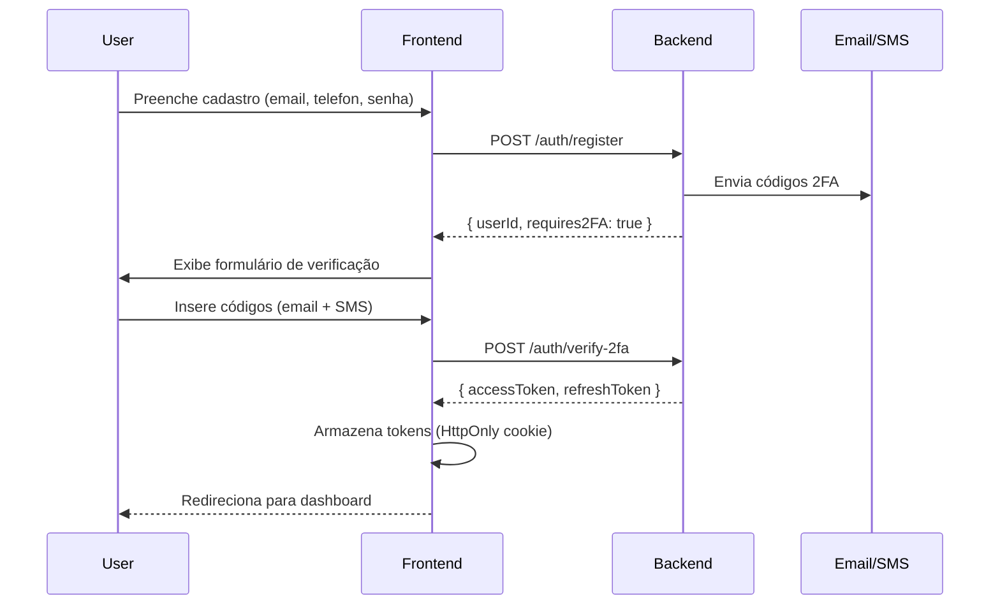
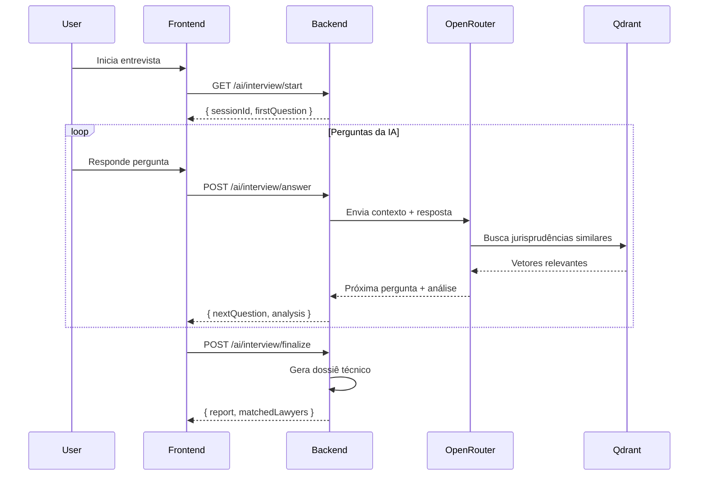

# 📚 Documentação Técnica - VozJusta Frontend

## Índice

1. [Visão Geral da Arquitetura](#visão-geral-da-arquitetura)
2. [Decisões Arquiteturais](#decisões-arquiteturais)
3. [Estrutura do Projeto](#estrutura-do-projeto)
4. [Fluxos de Dados](#fluxos-de-dados)
5. [Integração com Backend](#integração-com-backend)
6. [Sistema de Design](#sistema-de-design)
7. [Performance e Otimizações](#performance-e-otimizações)
8. [Segurança](#segurança)
9. [Testes](#testes)
10. [Deployment](#deployment)

---

## Visão Geral da Arquitetura

### Stack Tecnológica Unificada

O VozJusta utiliza **JavaScript/TypeScript** em todas as camadas da aplicação (Frontend Web, Mobile e Backend), proporcionando:

- **Isomorfismo de Código**: Compartilhamento de tipos, validações e lógica de negócio
- **Redução de Curva de Aprendizado**: Desenvolvedores podem transitar entre camadas
- **Consistência**: Mesmos padrões e convenções em todo o projeto
- **Produtividade**: Reutilização de código entre plataformas

### Arquitetura Frontend

```
┌─────────────────────────────────────────────────────────────┐
│                      FRONTEND WEB (Next.js)                  │
├─────────────────────────────────────────────────────────────┤
│                                                               │
│  ┌──────────────┐  ┌──────────────┐  ┌──────────────┐      │
│  │   Landing    │  │   Cidadão    │  │  Advogado    │      │
│  │     Page     │  │    Portal    │  │    Portal    │      │
│  └──────────────┘  └──────────────┘  └──────────────┘      │
│         │                  │                  │              │
│         └──────────────────┴──────────────────┘              │
│                            │                                 │
│                ┌───────────▼───────────┐                     │
│                │  Componentes Shared   │                     │
│                │  (UI Components)      │                     │
│                └───────────┬───────────┘                     │
│                            │                                 │
│         ┌──────────────────┼──────────────────┐             │
│         │                  │                  │             │
│    ┌────▼─────┐     ┌─────▼──────┐    ┌─────▼─────┐       │
│    │ Services │     │   Hooks    │    │   Utils   │       │
│    └────┬─────┘     └─────┬──────┘    └─────┬─────┘       │
│         └──────────────────┴──────────────────┘             │
│                            │                                 │
└────────────────────────────┼─────────────────────────────────┘
                             │
                             │ REST API / WebSocket
                             │
┌────────────────────────────▼─────────────────────────────────┐
│                      BACKEND (NestJS)                         │
│                                                               │
│  ┌──────────┐  ┌──────────┐  ┌──────────┐  ┌──────────┐   │
│  │   Auth   │  │   Cases  │  │    AI    │  │  Docs    │   │
│  │  Module  │  │  Module  │  │  Module  │  │  Module  │   │
│  └────┬─────┘  └────┬─────┘  └────┬─────┘  └────┬─────┘   │
│       └─────────────┴─────────────┴─────────────┘           │
│                          │                                   │
└──────────────────────────┼───────────────────────────────────┘
                           │
        ┌──────────────────┼──────────────────┐
        │                  │                  │
┌───────▼────────┐  ┌─────▼──────┐  ┌───────▼────────┐
│   PostgreSQL   │  │   Qdrant   │  │  Azure Blob    │
│   (Prisma)     │  │  (Vetores) │  │   Storage      │
└────────────────┘  └────────────┘  └────────────────┘
```

---

## Decisões Arquiteturais

### 1. Por que Next.js 16 (App Router)?

**Justificativa Técnica:**

- **Server Components**: Redução de JavaScript enviado ao cliente
- **Streaming SSR**: Carregamento progressivo de UI
- **Nested Layouts**: Layouts compartilhados sem re-renderização
- **Route Handlers**: API routes integradas no mesmo projeto
- **Otimizações Automáticas**: Image, Font e Script optimization out-of-the-box

**Alternativas Consideradas:**

| Tecnologia | Prós | Contras | Decisão |
|-----------|------|---------|---------|
| **Create React App** | Simplicidade, documentação | Sem SSR, build lento, deprecated | ❌ Rejeitado |
| **Vite + React** | Build rápido, flexível | Sem SSR nativo, configuração manual | ❌ Rejeitado |
| **Next.js (Pages Router)** | Estável, maduro | API antiga, menos performance | ❌ Rejeitado |
| **Next.js (App Router)** | SSR, Performance, SEO | Curva de aprendizado | ✅ **Escolhido** |

### 2. Por que TailwindCSS?

**Justificativa Técnica:**

- **Utility-First**: Desenvolvimento rápido sem sair do HTML/JSX
- **Purge CSS**: Apenas classes usadas no bundle final (~10KB)
- **Responsividade**: Prefixos mobile-first (sm:, md:, lg:)
- **Customização**: Tokens de design centralizados no `tailwind.config.ts`
- **DX**: Autocompletar no VSCode via Tailwind IntelliSense

**Comparação com Alternativas:**

```typescript
// CSS-in-JS (Styled Components / Emotion)
const Button = styled.button`
  background: #3b82f6;
  padding: 0.5rem 1rem;
  border-radius: 0.375rem;
  
  @media (min-width: 768px) {
    padding: 0.75rem 1.5rem;
  }
`

// TailwindCSS (escolhido)
<button className="bg-blue-500 px-4 py-2 rounded-md md:px-6 md:py-3">
  Clique aqui
</button>

// Benefício: -15KB no bundle (sem runtime CSS-in-JS)
```

### 3. Por que TypeScript?

**Prevenção de Bugs em Tempo de Compilação:**

```typescript
// Exemplo: Interface de Caso Jurídico
interface LegalCase {
  id: string
  userId: string
  type: 'consumerista' | 'trabalhista' | 'civil' | 'familiar'
  status: 'draft' | 'submitted' | 'reviewing' | 'matched' | 'completed'
  createdAt: Date
}

// ❌ Erro detectado no desenvolvimento (não em produção)
const caso: LegalCase = {
  id: '123',
  userId: '456',
  type: 'criminal', // ERRO: tipo não existe
  status: 'pending', // ERRO: status inválido
  createdAt: new Date()
}

// ✅ Autocomplete e type safety
function updateCaseStatus(caseId: string, status: LegalCase['status']) {
  // IDE sugere apenas: 'draft' | 'submitted' | 'reviewing' | 'matched' | 'completed'
}
```

---

## Estrutura do Projeto

### Organização de Pastas (App Router)

```
app/
├── (auth)/                    # Grupo de rotas com layout de autenticação
│   ├── layout.tsx
│   ├── login/
│   └── cadastro/
│
├── (dashboard)/               # Grupo de rotas autenticadas
│   ├── layout.tsx
│   ├── page.tsx              # Dashboard principal
│   ├── cidadao/
│   │   ├── casos/
│   │   ├── documentos/
│   │   └── perfil/
│   └── advogado/
│       ├── leads/
│       ├── casos/
│       └── analytics/
│
├── components/                # Componentes reutilizáveis
│   ├── layout/               # Header, Footer, Sidebar
│   └── ui/                   # Atomic Design Components
│
├── features/                  # Features isoladas
│   ├── landing-page/
│   ├── entrevista-ia/
│   └── simulador-audiencia/
│
├── lib/                      # Utilitários e configurações
│   ├── api-client.ts         # Axios configurado
│   ├── auth.ts               # Helpers de autenticação
│   └── utils.ts              # Funções auxiliares
│
└── types/                    # TypeScript types globais
    ├── api.ts
    └── models.ts
```

### Convenção de Nomenclatura

| Tipo | Convenção | Exemplo |
|------|-----------|---------|
| **Componentes** | PascalCase | `Button.tsx`, `UserProfile.tsx` |
| **Hooks** | camelCase com `use` | `useAuth.ts`, `useCases.ts` |
| **Utilitários** | camelCase | `formatDate.ts`, `validateCPF.ts` |
| **Types** | PascalCase com `.types.ts` | `button.types.ts` |
| **Constantes** | UPPER_SNAKE_CASE | `API_BASE_URL` |

---

## Fluxos de Dados

### 1. Fluxo de Autenticação (2FA)



### 2. Fluxo de Entrevista com IA



### 3. Fluxo de Match Cidadão-Advogado

```typescript
// services/match.service.ts
interface MatchCriteria {
  caseType: LegalCaseType // Ex: 'consumerista', 'trabalhista'
  urgency: 'low' | 'medium' | 'high'
  location: string // Estado/cidade
  budget?: number
}

interface LawyerProfile {
  id: string
  specialties: LegalCaseType[]
  rating: number // 0-5 estrelas
  casesWon: number
  responseTime: number // Em horas
  location: string
}

async function matchLawyers(criteria: MatchCriteria): Promise<LawyerProfile[]> {
  // Algoritmo de matching:
  // 1. Filtra advogados por especialidade
  const specialistLawyers = await filterBySpecialty(criteria.caseType)
  
  // 2. Pontuação ponderada
  const scoredLawyers = specialistLawyers.map(lawyer => ({
    ...lawyer,
    score: calculateScore(lawyer, criteria)
  }))
  
  // 3. Ordena por score e retorna top 5
  return scoredLawyers
    .sort((a, b) => b.score - a.score)
    .slice(0, 5)
}

function calculateScore(lawyer: LawyerProfile, criteria: MatchCriteria): number {
  return (
    lawyer.rating * 0.3 +                      // 30% rating
    (lawyer.casesWon / 100) * 0.2 +            // 20% histórico
    (1 / lawyer.responseTime) * 0.2 +          // 20% agilidade
    (lawyer.location === criteria.location ? 1 : 0) * 0.3  // 30% localização
  )
}
```

---

## Integração com Backend

### Configuração do Cliente HTTP

```typescript
// lib/api-client.ts
import axios, { AxiosInstance } from 'axios'

const apiClient: AxiosInstance = axios.create({
  baseURL: process.env.NEXT_PUBLIC_API_URL,
  timeout: 10000,
  headers: {
    'Content-Type': 'application/json',
  },
  withCredentials: true, // Envia cookies (JWT)
})

// Interceptor: Anexa token em todas as requisições
apiClient.interceptors.request.use((config) => {
  const token = getAccessToken() // De localStorage ou cookie
  if (token) {
    config.headers.Authorization = `Bearer ${token}`
  }
  return config
})

// Interceptor: Refresh token automático
apiClient.interceptors.response.use(
  (response) => response,
  async (error) => {
    if (error.response?.status === 401) {
      const newToken = await refreshAccessToken()
      if (newToken) {
        error.config.headers.Authorization = `Bearer ${newToken}`
        return apiClient.request(error.config) // Retry request
      }
    }
    return Promise.reject(error)
  }
)

export default apiClient
```

### Tipagem Compartilhada (Monorepo Pattern)

```typescript
// types/api.ts (sincronizado com backend via shared package)
export namespace API {
  export namespace Auth {
    export interface RegisterRequest {
      name: string
      email: string
      phone: string
      password: string
      userType: 'citizen' | 'lawyer'
    }
    
    export interface RegisterResponse {
      userId: string
      requires2FA: boolean
    }
    
    export interface LoginResponse {
      accessToken: string
      refreshToken: string
      user: {
        id: string
        name: string
        email: string
        userType: 'citizen' | 'lawyer'
      }
    }
  }
  
  export namespace Cases {
    export interface CreateCaseRequest {
      type: 'consumerista' | 'trabalhista' | 'civil' | 'familiar'
      description: string
      documents: File[]
    }
    
    export interface CaseResponse {
      id: string
      status: 'draft' | 'submitted' | 'reviewing' | 'matched' | 'completed'
      createdAt: string
      report?: {
        viability: 'high' | 'medium' | 'low'
        estimatedDuration: number // Em dias
        suggestedActions: string[]
      }
    }
  }
}
```

---

## Sistema de Design

### Tokens de Design (Tailwind Config)

```typescript
// tailwind.config.ts
import type { Config } from 'tailwindcss'

const config: Config = {
  theme: {
    extend: {
      colors: {
        // Paleta VozJusta
        primary: {
          50: '#eff6ff',
          100: '#dbeafe',
          500: '#3b82f6', // Azul principal
          600: '#2563eb',
          900: '#1e3a8a',
        },
        secondary: {
          500: '#8b5cf6', // Roxo
        },
        success: '#10b981',
        error: '#ef4444',
        warning: '#f59e0b',
      },
      fontFamily: {
        sans: ['Inter', 'sans-serif'],
        display: ['Poppins', 'sans-serif'],
      },
      spacing: {
        '128': '32rem',
        '144': '36rem',
      },
      borderRadius: {
        '4xl': '2rem',
      },
      boxShadow: {
        'card': '0 4px 6px -1px rgba(0, 0, 0, 0.1), 0 2px 4px -1px rgba(0, 0, 0, 0.06)',
        'card-hover': '0 20px 25px -5px rgba(0, 0, 0, 0.1), 0 10px 10px -5px rgba(0, 0, 0, 0.04)',
      },
    },
  },
}

export default config
```

### Atomic Design Pattern

```
components/ui/
├── atoms/               # Elementos indivisíveis
│   ├── Button/
│   ├── Input/
│   ├── Badge/
│   └── Icon/
│
├── molecules/           # Combinação de átomos
│   ├── InputWithLabel/
│   ├── SearchBar/
│   └── UserAvatar/
│
├── organisms/           # Seções complexas
│   ├── Header/
│   ├── Footer/
│   ├── CaseCard/
│   └── LawyerProfile/
│
└── templates/           # Layouts de página
    ├── DashboardLayout/
    └── AuthLayout/
```

---

## Performance e Otimizações

### 1. Code Splitting e Lazy Loading

```typescript
// app/dashboard/page.tsx
import dynamic from 'next/dynamic'

// Lazy load de componente pesado
const AIInterviewModal = dynamic(
  () => import('@/features/entrevista-ia/AIInterviewModal'),
  {
    loading: () => <Skeleton />,
    ssr: false, // Não renderizar no servidor
  }
)

export default function DashboardPage() {
  return (
    <div>
      <h1>Dashboard</h1>
      {/* Modal só carrega quando usuário clica */}
      <AIInterviewModal />
    </div>
  )
}
```

### 2. Otimização de Imagens

```tsx
import Image from 'next/image'

// Next.js Image: redimensionamento, lazy load, WebP automático
<Image
  src="/illustrations/hero.svg"
  alt="Ilustração Hero"
  width={800}
  height={600}
  priority // Carrega imagem do hero imediatamente
  placeholder="blur"
  blurDataURL="data:image/svg+xml;base64,..."
/>
```

### 3. Server Components (React 19)

```typescript
// app/dashboard/casos/page.tsx
import { prisma } from '@/lib/prisma'

// Este componente roda no SERVIDOR, não envia JS para o cliente
async function CasosPage() {
  // Busca dados direto do banco no servidor
  const casos = await prisma.case.findMany({
    where: { userId: getCurrentUserId() }
  })
  
  return (
    <div>
      {casos.map(caso => (
        <CaseCard key={caso.id} caso={caso} />
      ))}
    </div>
  )
}

export default CasosPage
```

### 4. Caching Estratégico

```typescript
// app/api/lawyers/route.ts
import { revalidatePath } from 'next/cache'

export async function GET() {
  // Cache por 1 hora (3600 segundos)
  const lawyers = await fetch('https://api.vozjusta.com/lawyers', {
    next: { revalidate: 3600 }
  })
  
  return Response.json(lawyers)
}

// Revalidar cache manualmente quando novo advogado se cadastra
export async function POST() {
  // ... lógica de cadastro
  revalidatePath('/advogados') // Limpa cache desta rota
}
```

---

## Segurança

### 1. Prevenção de XSS (Cross-Site Scripting)

```typescript
// React automaticamente escapa strings, mas cuidado com dangerouslySetInnerHTML
function UserComment({ comment }: { comment: string }) {
  // ❌ PERIGOSO: permite execução de scripts
  return <div dangerouslySetInnerHTML={{ __html: comment }} />
  
  // ✅ SEGURO: React escapa automaticamente
  return <div>{comment}</div>
  
  // ✅ Se precisar de HTML, sanitize antes
  import DOMPurify from 'isomorphic-dompurify'
  const cleanHTML = DOMPurify.sanitize(comment)
  return <div dangerouslySetInnerHTML={{ __html: cleanHTML }} />
}
```

### 2. Validação de Entrada (Zod)

```typescript
// contato/contact.schema.ts
import { z } from 'zod'

export const contactSchema = z.object({
  name: z.string()
    .min(3, 'Nome deve ter no mínimo 3 caracteres')
    .max(100, 'Nome muito longo'),
  
  email: z.string()
    .email('E-mail inválido')
    .toLowerCase(),
  
  phone: z.string()
    .regex(/^\(\d{2}\) \d{4,5}-\d{4}$/, 'Telefone inválido')
    .transform(phone => phone.replace(/\D/g, '')), // Remove formatação
  
  message: z.string()
    .min(10, 'Mensagem muito curta')
    .max(1000, 'Mensagem excede 1000 caracteres'),
})

// No componente
function ContactForm() {
  const handleSubmit = async (data: unknown) => {
    try {
      const validData = contactSchema.parse(data) // Valida e tipifica
      await sendContactEmail(validData)
    } catch (error) {
      if (error instanceof z.ZodError) {
        // Exibe erros de validação
        console.error(error.errors)
      }
    }
  }
}
```

### 3. Proteção de Rotas (Middleware)

```typescript
// middleware.ts (raiz do projeto)
import { NextResponse } from 'next/server'
import type { NextRequest } from 'next/server'
import { verifyJWT } from '@/lib/auth'

export async function middleware(request: NextRequest) {
  const token = request.cookies.get('accessToken')?.value
  
  // Rotas públicas
  if (request.nextUrl.pathname.startsWith('/api/public')) {
    return NextResponse.next()
  }
  
  // Rotas protegidas
  if (!token || !await verifyJWT(token)) {
    return NextResponse.redirect(new URL('/login', request.url))
  }
  
  return NextResponse.next()
}

export const config = {
  matcher: ['/dashboard/:path*', '/api/:path*'],
}
```

---

## Testes

### Estrutura de Testes (Planejado)

```
__tests__/
├── unit/                     # Testes unitários
│   ├── components/
│   │   ├── Button.test.tsx
│   │   └── Input.test.tsx
│   └── utils/
│       └── formatDate.test.ts
│
├── integration/              # Testes de integração
│   └── auth-flow.test.tsx
│
└── e2e/                      # Testes end-to-end
    └── cadastro-completo.spec.ts
```

### Exemplo de Teste Unitário (Jest + RTL)

```typescript
// __tests__/unit/components/Button.test.tsx
import { render, screen, fireEvent } from '@testing-library/react'
import { Button } from '@/components/ui/button'

describe('Button Component', () => {
  it('renderiza com texto correto', () => {
    render(<Button>Clique aqui</Button>)
    expect(screen.getByText('Clique aqui')).toBeInTheDocument()
  })
  
  it('chama onClick quando clicado', () => {
    const handleClick = jest.fn()
    render(<Button onClick={handleClick}>Clique</Button>)
    
    fireEvent.click(screen.getByText('Clique'))
    expect(handleClick).toHaveBeenCalledTimes(1)
  })
  
  it('desabilita quando loading=true', () => {
    render(<Button loading>Enviar</Button>)
    expect(screen.getByRole('button')).toBeDisabled()
  })
})
```

### Exemplo de Teste E2E (Playwright)

```typescript
// __tests__/e2e/cadastro-completo.spec.ts
import { test, expect } from '@playwright/test'

test('fluxo completo de cadastro cidadão', async ({ page }) => {
  // 1. Navegar para página de cadastro
  await page.goto('http://localhost:3000/cadastro')
  
  // 2. Preencher formulário
  await page.fill('input[name="name"]', 'João Silva')
  await page.fill('input[name="email"]', 'joao@example.com')
  await page.fill('input[name="phone"]', '(11) 98765-4321')
  await page.fill('input[name="password"]', 'SenhaSegura123!')
  
  // 3. Submeter formulário
  await page.click('button[type="submit"]')
  
  // 4. Verificar redirecionamento para verificação 2FA
  await expect(page).toHaveURL(/.*verificacao/)
  await expect(page.locator('text=Verificação de Código')).toBeVisible()
  
  // 5. Inserir código de verificação (mock)
  await page.fill('input[name="emailCode"]', '123456')
  await page.fill('input[name="smsCode"]', '654321')
  await page.click('button:has-text("Verificar")')
  
  // 6. Verificar redirecionamento para dashboard
  await expect(page).toHaveURL(/.*dashboard/)
  await expect(page.locator('text=Bem-vindo, João')).toBeVisible()
})
```

---

## Deployment

### Azure App Service - Configuração

#### 1. Dockerfile

```dockerfile
# Dockerfile
FROM node:18-alpine AS base

# Dependências
FROM base AS deps
WORKDIR /app
COPY package.json pnpm-lock.yaml ./
RUN corepack enable && pnpm install --frozen-lockfile

# Builder
FROM base AS builder
WORKDIR /app
COPY --from=deps /app/node_modules ./node_modules
COPY . .
RUN pnpm build

# Runner
FROM base AS runner
WORKDIR /app
ENV NODE_ENV=production
RUN addgroup --system --gid 1001 nodejs
RUN adduser --system --uid 1001 nextjs

COPY --from=builder /app/public ./public
COPY --from=builder --chown=nextjs:nodejs /app/.next/standalone ./
COPY --from=builder --chown=nextjs:nodejs /app/.next/static ./.next/static

USER nextjs
EXPOSE 3000
ENV PORT 3000

CMD ["node", "server.js"]
```

#### 2. Azure Pipeline (CI/CD)

```yaml
# azure-pipelines.yml
trigger:
  branches:
    include:
      - main

pool:
  vmImage: 'ubuntu-latest'

stages:
  - stage: Build
    jobs:
      - job: BuildAndTest
        steps:
          - task: NodeTool@0
            inputs:
              versionSpec: '18.x'
          
          - script: corepack enable && pnpm install
            displayName: 'Install dependencies'
          
          - script: pnpm lint
            displayName: 'Run ESLint'
          
          - script: pnpm test
            displayName: 'Run tests'
          
          - script: pnpm build
            displayName: 'Build Next.js'
          
          - task: Docker@2
            inputs:
              command: 'buildAndPush'
              repository: 'vozjusta-frontend'
              dockerfile: 'Dockerfile'
              tags: |
                $(Build.BuildId)
                latest

  - stage: Deploy
    dependsOn: Build
    condition: succeeded()
    jobs:
      - deployment: DeployToAzure
        environment: 'production'
        strategy:
          runOnce:
            deploy:
              steps:
                - task: AzureWebAppContainer@1
                  inputs:
                    azureSubscription: 'VozJusta-Azure-Connection'
                    appName: 'vozjusta-frontend-prod'
                    containers: 'vozjusta-frontend:$(Build.BuildId)'
```

#### 3. Variáveis de Ambiente (Azure)

Configurar no portal Azure → App Service → Configuration:

```bash
NEXT_PUBLIC_API_URL=https://api.vozjusta.com
NEXT_PUBLIC_ENVIRONMENT=production
OPENROUTER_API_KEY=***
RESEND_API_KEY=***
AZURE_STORAGE_CONNECTION_STRING=***
```

### Monitoramento (Azure Application Insights)

```typescript
// lib/instrumentation.ts
import * as appInsights from 'applicationinsights'

if (process.env.NODE_ENV === 'production') {
  appInsights.setup(process.env.APPLICATIONINSIGHTS_CONNECTION_STRING)
    .setAutoDependencyCorrelation(true)
    .setAutoCollectRequests(true)
    .setAutoCollectPerformance(true)
    .setAutoCollectExceptions(true)
    .start()
}

export const trackEvent = (name: string, properties?: Record<string, any>) => {
  appInsights.defaultClient?.trackEvent({ name, properties })
}

// Uso:
import { trackEvent } from '@/lib/instrumentation'

function handleCaseSubmit() {
  trackEvent('CaseSubmitted', { caseType: 'consumerista', userId: '123' })
}
```

---

## Conclusão

Esta documentação técnica detalha as decisões arquiteturais, padrões de código e fluxos de dados do frontend do VozJusta. Para dúvidas ou sugestões, consulte o [README.md](README.md) ou entre em contato com a equipe de desenvolvimento.

**Desenvolvido para o TCC SENAI Suíço Brasileiro - 2026**